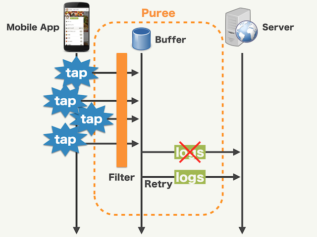

# Puree

# Description

Puree is a log collector which provides the following features:

- Filtering: Enable to interrupt process before sending log. You can add common params to logs, or the sampling of logs.
- Buffering: Store logs to buffers and send them later.
- Batching: Send multiple logs in a single request.
- Retrying: Retry to send logs after backoff time if sending logs fails.



Puree helps you unify your logging infrastructure.

[API Documentation](https://cookpad.github.io/puree-kotlin/api/)

# Installation

Gradle:

```gradle
repositories {
  mavenCentral()
}

dependencies {
  implementation("com.cookpad.puree-kotlin:puree-kotlin:$version")
}

```

# Usage

## Initialization

Logs are posted through a `PureeLogger` instance which should be configured with the filters, outputs, store to be used and the log types to be supported, in `Application#onCreate()`.

```kotlin
class MyApplication : Application() {
  lateinit var logger: PureeLogger

  override fun onCreate() {
    logger = PureeLogger.Builder(
      lifecycle = ProcessLifeycleOwner.get().lifecycle,
      logSerializer = MyLogSerializer(),
      logStore = DbPureeLogStore(this, "my_puree.db")
    )
      .filter(
        MyFilter(),
        MyLog::class.java
      )
      .output(
        MyOutput(),
        MyLog::class.java
      )
      .build()
  }
}
```

## Log objects and serialization

Log objects must implement the `PureeLog` interface.

```kotlin
data class MyLog(val eventName: String) : PureeLog
```

Internally, Puree operates on log objects as JSON objects. Puree requires clients to implement a `PureeLogSerializer` that serializes the logs to JSON.

Sample serializer using kotlinx.serialization

```kotlin
class MyLogSerializer : PureeLogSerializer {
  override fun serialize(log: PureeLog): JSONObject {
    val json = Json.encodeToString(log)
    return JSONObject(json)
  }
}
```

## Filters

`PureeFilter` can be registered to add common fields to specific logs.

```kotlin
class AddTimeFilter : PureeFilter {
  override fun applyFilter(log: JSONObject): JSONObject {
      return log.apply {
          put("event_time", System.currentTimeMillis())
      }
  }
}
```

`PureeFilter` can also be used to skip logs by returning `null`

```kotlin
class SamplingFilter(private val samplingRate: Float) : PureeFilter {
  override fun applyFilter(log: JSONObject): JSONObject? {
    return log.takeUnless { samplingRate < Random.nextFloat() }
  }
}
```

## Outputs

There are two types of outputs: non-buffered and buffered.

`PureeOutput`: Non-buffered output. Writes logs immediately.
`PureeBufferedOutput`: Buffered output. Enqueues logs to a local store and then flush them in the background.

For non-buffered outputs, implement a `PureeOutput`

```kotlin
class LogcatOutput : PureeOutput {
  override fun emit(log: JSONObject) {
      Log.d("Puree", log.toString())
  }
}
```

For buffered ouptuts, extend `PureeBufferedOutput`. Buffered outputs can be configured by overriding its settings.

```kotlin
class ServerLogBufferedOutput(private val logServerApi: LogServerApi) : PureeBufferedOutput("server_log_buffered") {
    override val flushInterval: Duration = Duration.ofMinutes(5) // Flush frequency
    override val logsPerFlush: Int = 1000 // Maximum number of logs in a batch.
    override val maxRetryCount: Int = 5 // Number of times a flush can be retried on failure
    override val exponentialBackoffBase: Duration = Duration.ofSeconds(2) // Base wait duration when retrying a failed flush
    override val purgeableAge: Duration? = Duration.ofDays(30) // How long the buffered logs are kept before purging
    override val maxFlushSizeInBytes: Long = Long.MAX_VALUE // The maximum size in bytes of the whole payload

    override fun emit(logs: List<JSONObject>, onSuccess: () -> Unit, onFailed: (Throwable) -> Unit) {
      logServerApi.send(logs) { isSuccessful ->
        if (isSuccessful) {
          onSuccess()
        } else {
          onFailed(IOException("Error"))
        }
      }
    }
}
```

## Posting logs

Send logs using the `PureeLogger` instance:

```kotlin
val pureeLogger = PureeLogger.Builder()
  // Configure the logger
  .build()

pureeLogger.postLog(MyLog())
```

## Release engineering

* Update publication version in `gradle/publishing.gradle`
* Create a Release in Github
* Add release notes
* Publish release

## License

```
Copyright (c) 2021 Cookpad Inc.

Permission is hereby granted, free of charge, to any person obtaining a copy
of this software and associated documentation files (the "Software"), to deal
in the Software without restriction, including without limitation the rights
to use, copy, modify, merge, publish, distribute, sublicense, and/or sell
copies of the Software, and to permit persons to whom the Software is
furnished to do so, subject to the following conditions:

The above copyright notice and this permission notice shall be included in all
copies or substantial portions of the Software.

THE SOFTWARE IS PROVIDED "AS IS", WITHOUT WARRANTY OF ANY KIND,
EXPRESS OR IMPLIED, INCLUDING BUT NOT LIMITED TO THE WARRANTIES OF
MERCHANTABILITY, FITNESS FOR A PARTICULAR PURPOSE AND NONINFRINGEMENT.
IN NO EVENT SHALL THE AUTHORS OR COPYRIGHT HOLDERS BE LIABLE FOR ANY CLAIM,
DAMAGES OR OTHER LIABILITY, WHETHER IN AN ACTION OF CONTRACT, TORT OR
OTHERWISE, ARISING FROM, OUT OF OR IN CONNECTION WITH THE SOFTWARE OR THE USE
OR OTHER DEALINGS IN THE SOFTWARE.

```
